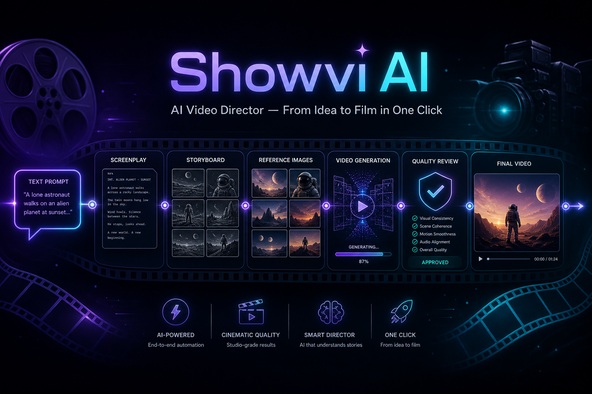

> **本仓库的视频审核用法**：请先阅读仓库根目录的 [`../README.md`](../README.md)。  
> 下文是上游 **Showvi 视频生成系统**文档；定制插件与审核工具索引见 [`README_CUSTOM.md`](README_CUSTOM.md)。

<p align="center">
  
</p>

<p align="center">
  <strong>AI 视频导演系统 — 从一句话到成片，多智能体全流程自动化</strong>
</p>

<p align="center">
  <b>简体中文</b> | <a href="README_EN.md">English</a>
</p>

<p align="center">
  
  
  
  
  
</p>

---

## 什么是 Showvi？

**Showvi** 是一套由多个 AI 智能体协作驱动的端到端视频自动生产系统。你只需要输入一句话创意、一段小说、或一个参考视频，多个专职 Agent 会接力完成从剧本、分镜、参考图生成，到视频生成、质量审核、智能改写、最终剪辑的全部工作。

它的核心不是"调一次 API 生成一段视频"，而是一个**持续自我优化的生产闭环**：

- **Agent 驱动的连续性剧情与视频生成**：长视频最大的难题是"前后不连贯"——角色突然变脸、场景莫名跳转、叙事逻辑断裂。Showvi 的多智能体流水线从剧本阶段就进行**跨分段实体状态追踪**（换装、受伤、变身等），在视频生成阶段通过**连续性导演 Agent** 全局把控画面衔接与叙事过渡，配合**16 宫格关键帧传递**和**转场桥接**，让每一段视频都"知道"前后文在发生什么，从根源上解决长视频割裂感。

- **Seedance 智能体自动规避平台审核限制**：即梦平台对真人面部、敏感 IP、暴力/色情等内容设有多层检测。Showvi 的 Agent 会在**生成被拦截时自动识别拦截原因**（真人脸检测、敏感词、IP 侵权等 6 类问题），并通过**渐进式 prompt 改写策略**自动绕开限制——越试越精准，无需人工干预反复修改提示词。

生成的每一段视频都会被 **VLM 多维审核**（画面质量、角色一致性、物理合理性等），不达标则自动改写提示词重拍，直到满意为止。参考图生成支持 **Google Gemini** 和 **gpt-image-2** 等多种后端。视频生成基于 **Seedance 2.0**，通过即梦网页接口使用自定义账户以**VIP/非 VIP 模式自动排队提交**，大幅节省时间/积分，全程无需人工盯守。

---

## 核心能力

### 📥 多种创作入口

| | 入口 | 描述 |
| :---: | :--- | :--- |
| 💡 | **一句话创意** | 输入一句灵感描述，AI 自动展开为完整剧本并生成视频 |
| 📖 | **小说转视频** | 粘贴小说 / 故事章节，自动拆解叙事结构、分镜并生成视频 |
| 🔁 | **视频复刻** | 上传参考视频，AI 分析镜头语言与节奏，生成同风格新内容 |
| ✂️ | **视频二创** | 基于已有视频素材进行二次创作，重新编排叙事与画面 |

### ⚙️ 技术特性

| 功能 | 说明 |
| :--- | :--- |
| 🤖 **多智能体协作分镜** | 6 个专职 LLM Agent 接力：剧本 → 依赖分组 → 实体状态追踪 → 分镜转换 → 连续性导演 → 自动验证修复 |
| 🧬 **实体延续性状态追踪** | 自动识别角色换装、受伤、变身、道具损坏等跨分段状态变化，生成衍生参考图 |
| 🎬 **Seedance 2.0 自动化** | 浏览器自动操控即梦，非 VIP 模式自动排队，节省积分；支持 seedance-2.0 / fast / vip 等全系列 |
| 🔬 **VLM 质检闭环** | Generate → Critique → Rewrite → Retry；Gemini 多维评审画面质量、角色一致性、物理合理性等 |
| 🧩 **参考图一致性系统** | 角色 / 场景 / 道具参考图自动生成，VLM 校验后注入视频生成，跨镜头不走样 |
| 🔗 **跨镜头连续性保障** | 16 宫格关键帧传递 + 转场桥接 + 连续性导演，分段画面无缝衔接 |
| 🛡️ **违规自适应改写** | 审核拦截时自动识别 IP / 暴力 / 色情等 6 类问题，渐进式改写规避，越试越稳 |
| ⚡ **断点续跑** | 每步保存 checkpoint，崩溃后自动恢复云端在飞任务，已替换素材受保护不被覆盖 |

---

## 🤖 多智能体分镜流水线

分镜生成不是一次 LLM 调用，而是 **6 个专职智能体接力协作**的流水线：

> 📥 创意输入（一句话 / 小说 / 参考视频）

| Step | Agent | 做什么 |
| :---: | :--- | :--- |
| **1** | 🎭 剧本生成 | 从创意出发，生成含戏剧结构的完整叙事（hook → conflict → climax → payoff） |
| **2** | 🔗 依赖分组 | 分析相邻分段的空间连续性，确定哪些分段必须串行生成、哪些可以并行 |
| **3** | 🧬 实体状态追踪 | 两轮 LLM 分析，识别角色换装 / 受伤 / 变身等跨分段状态变化，注册衍生实体 |
| **4** | 🎬 分镜转换 | 叙事段 → 技术分镜，补充镜头运动、光线、视觉描述 |
| **5** | 🎼 连续性导演 | 全局润色所有分段的 Seedance prompt，确保分段间画面和叙事过渡流畅 |
| **6** | ✅ 验证修复 | 自动修正角色别名、对白归属、连续性文本错误，输出可执行分镜 JSON |

> 📤 输出：结构化分镜 JSON（含角色 / 场景 / 道具定义及衍生实体变体）

---

## 🔬 VLM 质检闭环

每一段视频生成后，都会进入自动质检 → 改写 → 重试的循环，直到达到质量阈值或用完重试预算：

> **生成** → **VLM 质检**（score ≥ 7 通过）→ 不通过则 **改写 Prompt** → 重新 **生成** → … → 通过后进入 **候选池** → VLM 对比 **选最佳** → **拼接成片**

Gemini VLM 从 **6 个维度** 评审每段视频：画面质量、内容准确度、角色一致性、艺术性、物理合理性、模型穿模。低分视频的 critique 反馈会自动喂给 prompt 改写 Agent，定向修复问题后重新生成。多次 attempt 中由 VLM 对比选出最佳片段，最终拼接成片。即使全部未通过阈值，也会自动选取评分最高的兜底，不会留空。

---

## 🎬 生产流水线

从创意输入到最终成片，7 个环节全自动串联：

| Step | 环节 | 说明 |
| :---: | :--- | :--- |
| **1** | 📥 创意输入 | 一句话创意 / 小说章节 / 参考视频，三种入口任选 |
| **2** | 🤖 多智能体分镜 | 6 步 Agent 协作：剧本 → 分组 → 状态追踪 → 分镜 → 连续性导演 → 验证 |
| **3** | 🖼️ 参考图生成 | 角色 / 场景 / 道具参考图并行生成，VLM 校验一致性 |
| **4** | 🎬 视频生成 | Seedance 2.0 即梦账户自动排队，支持 VIP / 非 VIP 模式，并行 Worker 执行 |
| **5** | 🔬 VLM 质检 | Gemini 多维评审 → 不通过则改写 Prompt → 重新生成 |
| **6** | 🏆 智能选片 | VLM 对比多个候选视频，选出每个分段的最佳片段 |
| **7** | 🎞️ 成片输出 | 音频响度归一化 + 交叉淡入，拼接输出 `final_video.mp4` |

---

## 🚀 快速启动

### 1. 安装依赖

```bash
git clone https://github.com/sjtuplayer/showvi.git
cd showvi

python3 -m venv .venv
source .venv/bin/activate

pip install -r requirements.txt
playwright install chromium
```

### 2. 配置环境变量

```bash
cp .env.example .env
```

编辑 `.env`，填入你的 API Key（详见下方[配置说明](#-配置说明)）。

### 3. 启动 Web Dashboard

```bash
python -m dashboard.server --port 8501
```

### 4. 打开浏览器

访问 **http://localhost:8501** ， 进入 Showvi Dashboard 开始创作。

Dashboard 提供完整可视化操作界面：首页一句话成片、剧本生成、创作台监控、剧本库管理、素材库浏览、系统设置 —— 所有操作均可在 Web 界面完成。

---

## ⚙️ 配置说明

编辑 `.env` 文件，配置以下三项必填服务。详细选项参见 [`.env.example`](.env.example)。

也可以在网页端的设置中进行配置

### 1. LLM（大语言模型）

支持两种 Provider，在 Dashboard 设置页或 `.env` 中切换：

| Provider | 配置 | 说明 |
| :--- | :--- | :--- |
| **Google 官方** | `LLM_PROVIDER=google` | 原生支持视频理解，推荐用于视频质检、分镜等多模态任务 |
| **OpenAI-compatible** | `LLM_PROVIDER=openai_compatible` | 适配 DeepSeek / Moonshot / Qwen / OpenRouter 等 |

```bash
# Google 官方
LLM_PROVIDER=google
GEMINI_API_KEY=your-gemini-api-key
LLM_MODEL=gemini-2.5-flash

# 或 OpenAI-compatible
# LLM_PROVIDER=openai_compatible
# LLM_BASE_URL=https://api.deepseek.com/v1
# LLM_API_KEY=your-key
# LLM_MODEL=deepseek-chat
```

不同步骤可指定不同模型（可选）：

```bash
# LLM_MODEL_SCREENPLAY_GEN=deepseek-reasoner   # 剧本生成用推理模型
# LLM_PROVIDER_VIDEO_CRITIQUE=google            # 视频质检需要视频理解能力
# LLM_MODEL_VIDEO_CRITIQUE=gemini-2.5-pro
```

### 2. 图片生成

支持两种 Provider：

| Provider | 配置 | 说明 |
| :--- | :--- | :--- |
| **Google 官方** | `IMAGE_PROVIDER=google` | 使用 Gemini 图片生成，复用 `GEMINI_API_KEY`，无需额外 key |
| **OpenAI-compatible** | `IMAGE_PROVIDER=openai_compatible` | 支持 gpt-image-2 / DALL-E 3 / Flux 等 |

```bash
# Google 官方（复用 GEMINI_API_KEY）
IMAGE_PROVIDER=google
IMAGE_MODEL=gemini-2.0-flash-preview-image-generation

# 或 OpenAI-compatible
# IMAGE_PROVIDER=openai_compatible
# IMAGE_BASE_URL=https://api.openai.com/v1
# IMAGE_API_KEY=your-key
# IMAGE_MODEL=gpt-image-2
```

### 3. 视频生成 — 即梦 Seedance 2.0

```bash
SEEDDANCE_SESSION_ID=your-session-id
SEEDDANCE_BACKEND=jimeng
```

<details>
<summary><b>如何获取 SEEDDANCE_SESSION_ID</b></summary>

1. 在浏览器中打开 [即梦](https://jimeng.jianying.com) 并登录你的账户
2. 按 `F12` 打开开发者工具，切换到 **Application**（应用）标签页
3. 左侧展开 **Cookies** → 选择 `https://jimeng.jianying.com`
4. 在 Cookie 列表中找到 `sessionid`，复制其 **Value** 值
5. 将该值填入 `.env` 文件的 `SEEDDANCE_SESSION_ID`

</details>

Agent 默认使用 **非 VIP 模式**（`seedance-2.0`），自动排队生成，无需消耗高价 VIP 积分。如需 VIP 模式（更快但消耗更多积分），可切换为 `seedance-2.0-vip`。

> **关于 jimeng CLI：** 当前版本通过即梦网页接口提交任务。由于 jimeng CLI 功能暂未完善，后续版本将迁移到 jimeng CLI 调用 Seedance，届时无需手动获取 session_id。

完整配置项及说明参见 [`.env.example`](.env.example)。

---

## 📄 License

[MIT](LICENSE)
